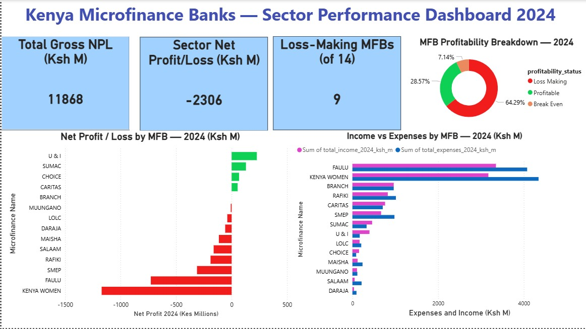
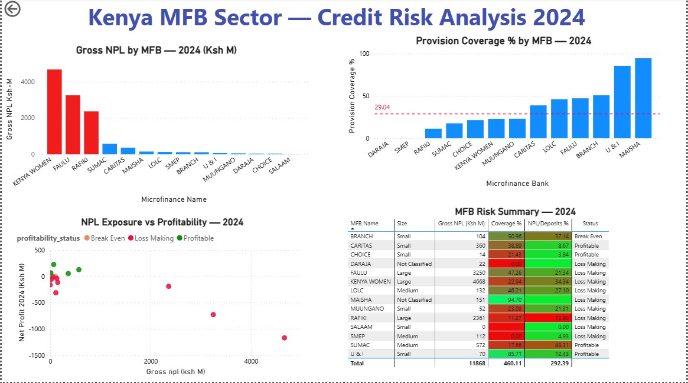
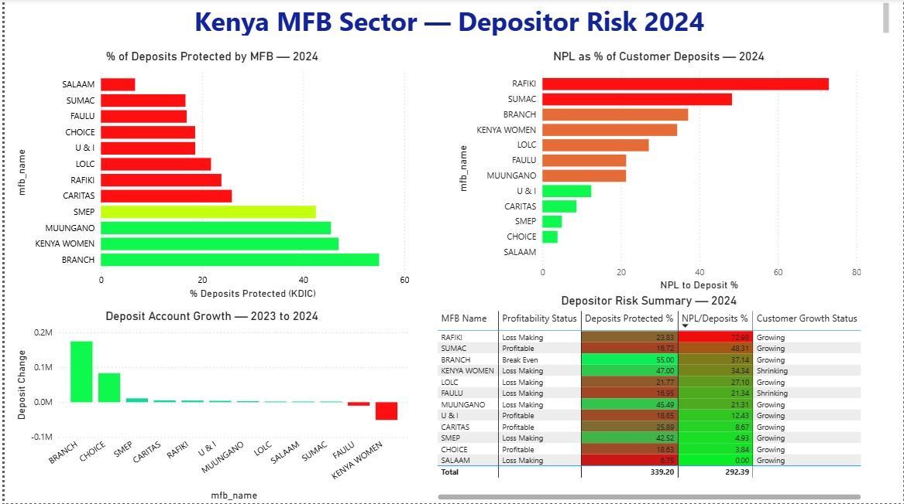

Kenya Microfinance Banks — Sector Performance Dashboard 2024

Tools: MySQL · Power BI · Microsoft Excel

Data Sources: Central Bank of Kenya (CBK) Bank Supervision Annual Report 2024 

Domain: Credit Risk · Portfolio Analytics · Microfinance · Financial Services

Project Overview

This project analyses the financial health, credit risk exposure, and depositor risk profile of Kenya's 14 licensed Microfinance Banks (MFBs) using official regulatory data from the Central Bank of Kenya.

The analysis was built entirely from scratch — extracting structured data from PDF regulatory reports, modelling it in MySQL, and visualising findings in a three-page Power BI dashboard. The project replicates the kind of end-to-end analytical workflow used in credit risk and portfolio analytics roles in Kenya's financial services sector.

Business Questions Answered

How healthy is Kenya's MFB sector overall — and which institutions are driving sector-wide losses?
Where is credit risk (NPL exposure) concentrated, and which MFBs are least prepared to absorb losses?
Which institutions pose the highest risk to depositors — and what is driving that risk?

Data Sources

| Source |                            | Report |                            |Data Extracted |

| Central Bank of Kenya (CBK)         | Bank Supervision Annual Report 2024 | NPL data, deposit accounts, protected deposits, MFB performance |

| Kenya Bankers Association (KBA)     | State of Banking Industry Report 2025 | Sector context and market benchmarks | 

Note: The sources are publicly available PDF reports. Data was manually extracted from tables in the reports and structured into CSV files for database import. No proprietary or confidential data was used.

Data Engineering

Tables Built

| Table Name                    | Rows | Description                                                                         
  npl_by_mfb14                  | 14   | Gross NPLs, interest in suspense, impairment allowances, and net NPLs per MFB.                 
  performance_by_mfb14          | 14   | Full income statement per MFB, including income, 9 expense line items, and net       profit/loss.    

  deposit_accounts_by_mfb14     | 14   | Deposit account counts by balance tier (under/over KSh 500,000), comparing Dec 2023 vs Dec 2024. 

  protected_deposits_by_mfb14   | 14   | KDIC-insured deposits versus total customer deposits, comparing Dec 2023 vs Dec 2024.            

Data Quality Issues Documented

Cross-table bank inconsistency: Daraja and Maisha MFBs appear in NPL and performance data but not in deposit account or protected deposit tables — likely reflecting differences in CBK reporting timelines for newly licensed institutions. These banks return NULL values for deposit-related metrics in joined queries. This is handled transparently using LEFT JOINs rather than silently excluded.
UTF-8 BOM encoding: Two CSV files exported from Excel contained a UTF-8 Byte Order Mark () that MySQL attached to the first column name, breaking queries referencing that column. Fixed by re-exporting as plain CSV (non-UTF-8) format.
Comma-formatted numbers: Large numbers exported from Excel with thousand-separator commas (e.g. 1,012,190) caused MySQL import failures. Fixed by removing formatting before export.
Negative provision value: Faulu MFB shows a negative Provision for Loan Impairment (-71M) in Appendix XI, representing a provision reversal — more recovered than set aside in 2024. Retained as negative in the dataset as it correctly reduces total expenses.

Database Design

All four tables were joined into a single master VIEW for Power BI consumption:

sqlCREATE VIEW vw_mfb_dashboard AS
SELECT
    n.mfb_name,
    n.mfb_size,
    n.gross_npl_ksh_m,
    n.net_npl_ksh_m,
    n.impairment_allowance_ksh_m,
    ROUND((n.impairment_allowance_ksh_m /
        NULLIF(n.gross_npl_ksh_m, 0)) * 100, 2) AS provision_coverage_pct,
    p.total_income_2024_ksh_m,
    p.total_expenses_2024_ksh_m,
    p.net_profit_2024_ksh_m,
    ROUND((p.total_expenses_2024_ksh_m /
        NULLIF(p.total_income_2024_ksh_m, 0)) * 100, 2) AS cost_to_income_pct,
    CASE
        WHEN p.net_profit_2024_ksh_m > 0 THEN 'Profitable'
        WHEN p.net_profit_2024_ksh_m = 0 THEN 'Break Even'
        ELSE 'Loss Making'
    END AS profitability_status,
    d.dec24_total AS total_deposit_accounts_2024,
    d.dec23_total AS total_deposit_accounts_2023,
    d.change_total AS deposit_account_change,
    CASE
        WHEN d.change_total > 0 THEN 'Growing'
        WHEN d.change_total = 0 THEN 'Flat'
        WHEN d.change_total IS NULL THEN 'No Data'
        ELSE 'Shrinking'
    END AS customer_growth_status,
    pd.dec24_customer_ksh_m AS customer_deposits_2024_ksh_m,
    pd.dec23_customer_ksh_m AS customer_deposits_2023_ksh_m,
    pd.dec24_insured_ksh_m AS insured_deposits_2024_ksh_m,
    (pd.dec24_customer_ksh_m - pd.dec24_insured_ksh_m)
        AS unprotected_deposits_ksh_m,
    ROUND((pd.dec24_insured_ksh_m /
        NULLIF(pd.dec24_customer_ksh_m, 0)) * 100, 2) AS pct_deposits_protected,
    ROUND((n.gross_npl_ksh_m /
        NULLIF(pd.dec24_customer_ksh_m, 0)) * 100, 2) AS npl_to_deposits_pct
FROM npl_by_mfb n
JOIN performance_by_mfb p ON n.mfb_name = p.mfb_name
LEFT JOIN deposit_accounts_by_mfb d ON n.mfb_name = d.mfb_name
LEFT JOIN protected_deposits_by_mfb pd ON n.mfb_name = pd.mfb_name;

Why LEFT JOIN for deposit tables: Daraja and Maisha are present in NPL and performance data but absent from deposit tables. Using LEFT JOIN preserves all 14 MFBs in the output with NULL values for missing deposit metrics — ensuring no institution is silently excluded from analysis.

Key Findings

Finding 1 — Sector Profitability Crisis

9 of 14 Kenyan MFBs posted losses in 2024. The sector recorded a combined net loss of Ksh 2.3 billion. The two largest institutions — Kenya Women MFB (-Ksh 1,171M) and Faulu MFB (-Ksh 728M) — account for the majority of sector losses.

Finding 2 — Two Distinct Loss Drivers

The data reveals two structurally different causes of loss, concentrated by institution size:

Large MFBs lose money primarily due to NPL burden — high volumes of non-performing loans generate provisions and reduce net income
Small MFBs lose money primarily due to cost inefficiency — SALAAM's cost-to-income ratio of 411% means it spends Ksh 4.11 for every Ksh 1.00 earned, despite carrying zero NPLs

This distinction matters for policy and intervention: the same outcome (losses) requires completely different remedies depending on the institution.

Finding 3 — Provision Coverage Gap

The sector-wide provision coverage ratio is 29% — meaning only Ksh 0.29 has been set aside for every Ksh 1.00 of gross NPLs. Two institutions carry real NPL exposure with zero provisions:

SMEP: Ksh 112M gross NPL, 0% coverage
DARAJA: Ksh 22M gross NPL, 0% coverage

These represent fully unmitigated risk on the sector balance sheet.

Finding 4 — The Rafiki Paradox

Rafiki MFB has the highest NPL-to-deposits ratio in the sector at 72% — meaning Ksh 0.72 of every Ksh 1.00 deposited is tied up in non-performing loans. Despite this, Rafiki's deposit account base grew between 2023 and 2024. Customer behaviour has not yet responded to the institution's credit risk signals — a leading indicator worth monitoring.

Finding 5 — SALAAM Depositor Risk Profile

SALAAM presents the highest depositor risk in the sector by deposit protection metrics — the lowest percentage of customer deposits covered by KDIC insurance — while simultaneously being loss-making with a 411% cost-to-income ratio. Critically, this risk is operational, not credit-driven: SALAAM carries zero NPLs. Its depositors are exposed to institutional failure risk from unsustainable cost structure, not bad loans.

Finding 6 — Size Does Not Predict Profitability

U&I, a Small MFB, is the most cost-efficient institution in the sector with a cost-to-income ratio of 42.96% — outperforming all Large and Medium MFBs. The most profitable institutions in 2024 were all Small or Medium MFBs (U&I, Sumac, Caritas, Choice). Large institution size in Kenya's MFB sector correlates with higher NPL exposure, not stronger financial performance.

Dashboard Structure

Page 1 — Sector Overview

KPI cards: Total Gross NPL (Ksh 11,868M), Sector Net Profit/Loss (-Ksh 2,306M), Loss-Making MFBs (9 of 14)
Bar chart: Net profit/loss by MFB with profitability colour coding
Donut chart: Profitability breakdown (64% loss-making, 29% profitable, 7% break-even)
Clustered bar chart: Income vs expenses by MFB

Page 2 — Credit Risk Analysis

Bar chart: Gross NPL ranking by MFB (Large MFBs highlighted in red)
Bar chart: Provision coverage % with sector average reference line at 29%
Scatter plot: NPL exposure vs profitability (colour-coded by profitability status)
Heatmap table: MFB risk summary with conditional formatting on coverage % and NPL/deposits %

Page 3 — Depositor Risk

Bar chart: % deposits protected by KDIC per MFB
Bar chart: NPL as % of customer deposits per MFB
Bar chart: Deposit account growth 2023–2024
Heatmap table: Full depositor risk summary

Repository Structure

kenya-mfb-dashboard/
│
├── data/
│   ├── npl_by_mfb.csv
│   ├── performance_by_mfb.csv
│   ├── deposit_accounts_by_mfb.csv
│   └── protected_deposits_by_mfb.csv
│
├── sql/
│   ├── 01_create_tables.sql
│   ├── 02_analysis_queries.sql
│   └── 03_create_view.sql
│
├── dashboard/
│   └── Kenya_MFB_Dashboard_2024.pbix
│
└── README.md

How to Reproduce

1. Clone this repository
2. In MySQL Workbench, run `sql/01_create_tables.sql` 
   to create the `kenya_mfb_2024` database and tables
3. Import each CSV from `/data` into its matching table 
   using the Table Data Import Wizard in MySQL Workbench
   — remove thousand-separator commas from numeric columns 
   before importing, and export as plain CSV (not UTF-8) 
   to avoid BOM encoding issues
4. Run `sql/02_analysis_queries.sql` to verify data loaded correctly
5. Run `sql/03_create_view.sql` to create the master dashboard view
6. Open `dashboard/Kenya_MFB_Dashboard_2024.pbix` in Power BI Desktop
   — update the MySQL connection to `localhost` / `kenya_mfb_2024`

Limitations

Data covers December 2024 (single point in time for most metrics) with limited 2023 comparisons — trend analysis is constrained by available data
Daraja and Maisha MFBs have incomplete data across all four source tables
NPL classification methodology may vary by institution — CBK guidelines provide a framework but application is institution-specific
All figures are in Ksh Millions as reported in CBK source documents

Recommendations 

1. CBK should prioritise supervisory attention on SMEP and DARAJA given zero provision coverage against real NPL exposure
2. SALAAM requires an operational restructuring review — its risk profile is cost-driven, not credit-driven, and standard NPL-focused monitoring frameworks would miss it entirely
3. Rafiki's deposit account growth despite a 72% NPL-to-deposits ratio suggests market discipline is lagging risk signals — a depositor awareness gap worth monitoring

About

Built by Jane Ng'ang'a — Data Analyst specialising in credit and portfolio analytics.
[LinkedIn](https://www.linkedin.com/in/ng-ang-a-jane/)
